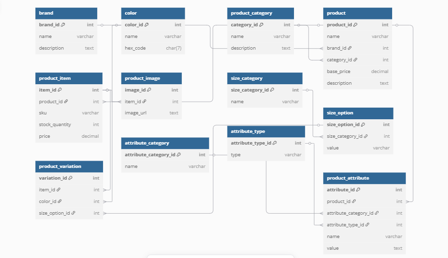

# 🛍️ E-commerce Database Design

## 📌 Project Overview
This project presents a well-structured relational database model for a modern e-commerce platform. It defines all required entities and their relationships through an Entity-Relationship Diagram (ERD) and a normalized SQL schema.

## 🎯 Objectives
- Design an Entity-Relationship Diagram for an e-commerce system.
- Implement the database with appropriate keys, constraints, and relationships.
- Ensure data integrity and scalability for real-world applications.

## 🧱 Database Structure

### Tables Included:
- `brand`: Brand details.
- `color`: Available color options.
- `product_category`: Categories of products.
- `product`: Product information with links to brand and category.
- `product_item`: Specific purchasable units (SKU level).
- `product_image`: Stores image references for items.
- `product_variation`: Connects items to color and size.
- `size_category`: Groups sizes (e.g., clothing or shoe sizes).
- `size_option`: Lists individual sizes.
- `attribute_category`: Groups custom attributes.
- `attribute_type`: Defines attribute data types.
- `product_attribute`: Product-specific additional properties.

## 📂 Files Included

| File                | Description                                 |
|---------------------|---------------------------------------------|
| `ecommerce.sql`     | SQL script to create all necessary tables.  |
| `ERD.png`           | ERD diagram showing all entities visually.  |
| `README.md`         | Project documentation (this file).          |

## 🛠️ Tools Used
- **MySQL**
- **dbdiagram.io** for ERD
- **GitHub** for version control

## ERD Preview

## 🧪 Setup Instructions
1. Clone the repository.
2. Import `ecommerce.sql` into your MySQL server.
3. Explore and modify according to your application logic.

---

Happy building! 🚀
